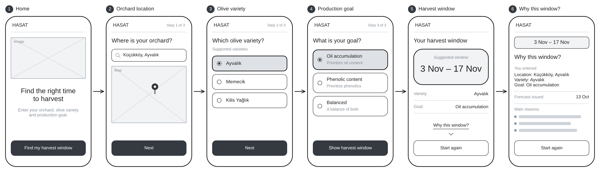
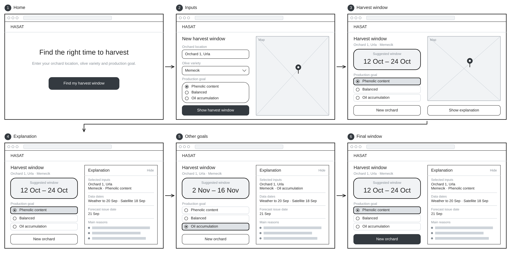

# Happy Paths of the User Personas

Both personas complete the MVP grower workflow: enter the orchard location, select a supported olive variety and a production goal, then view the harvest window and its explanation. Each step below is one wireframe screen. Dates and variety names are illustrative.

## Happy Path 1: Mehmet gets a harvest window for oil accumulation

**Scenario:** Before the harvest season starts, Mehmet opens HASAT in his phone's browser to learn when to harvest, so that he can arrange his workers and his delivery to the mill.

1. **Home:** He taps "Find my harvest window".
2. **Orchard location:** He searches for his village and places the pin on his orchard.
3. **Olive variety:** He selects "Ayvalık" from the supported varieties.
4. **Production goal:** He selects "Oil accumulation" and taps "Show harvest window". The system estimates ripening progression and prepares the recommendation.
5. **Harvest window:** The system shows the suggested window, 3 Nov – 17 Nov, with his variety and goal.
6. **Why this window?** He scrolls down and reads what he entered, when the forecast was issued and the main reasons, in plain language.

**Successful end:** Mehmet knows his harvest window and why it was suggested, and he calls his workers and the mill.

**Figure 1.** Wireframe screens of Happy Path 1 (phone browser).

## Happy Path 2: Elif finds the window for a high-phenolic oil

**Scenario:** Elif plans the season on her laptop. She wants the harvest window for one of her orchards under the "phenolic content" goal, and she wants to see how much later she would harvest under the other goals.

1. **Home:** She clicks "Find my harvest window".
2. **Inputs:** She places the pin on her first orchard, selects "Memecik" and the "Phenolic content" goal, then clicks "Show harvest window".
3. **Harvest window:** The system shows the suggested window, 12 Oct – 24 Oct, with her variety and goal.
4. **Explanation:** She opens the explanation panel, which shows the selected inputs, data dates, forecast issue date and main reasons.
5. **Other goals:** She switches the goal to "Balanced" and then to "Oil accumulation". The window updates each time for the same orchard and variety.
6. **Final window:** She switches back to "Phenolic content" and the original window returns.

**Successful end:** Elif has a harvest window that matches her goal, understands the reasons behind it and knows what she would trade by harvesting later. She books her workers and her mill slot herself, then starts again for her next orchard.

**Figure 2.** Wireframe screens of Happy Path 2 (desktop browser).